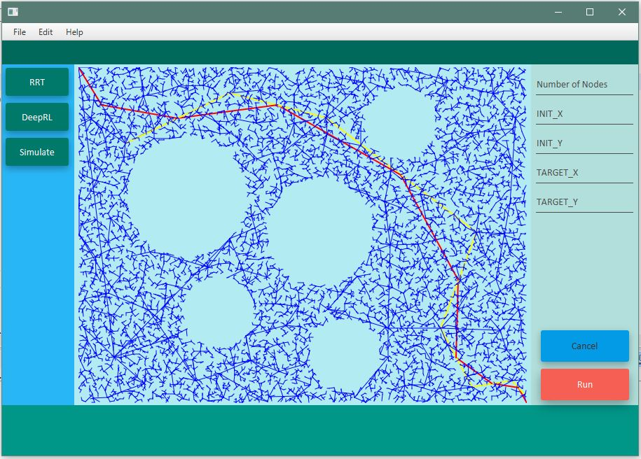

# Algorithms

## Air Team, Unmanned Systems, ECE-UWF

This repository is a collection of algorithms used by the Air Team at the University of West Florida for different parts of the SUAS project such as Motion Planning, Obstacle Avoidance, Object Detection and Classification, etc.

### Rapidly-Exploring Random Tree (RRT)

Rapidly-Exploring Random Tree (RRT) is a probabilistically complete and computationally efficient algorithm used for path planning in Robotics. This repository contains a basic RRT implemented in Java.

